# Avaliação Exploratória - Página de Certificação

**URL Avaliada:** `https://qualidade.apprbs.com.br/certificacao`

## Item 1 - Botão "Saiba mais" sem ação na página inicial
* **Tipo:** Correção
* **Classificação:** Utilidade
* **Prioridade:** Média
* **Descrição:** Ao interagir com o botão "Saiba mais" na tela inicial, nenhuma ação é executada e o usuário não é redirecionado. O comportamento esperado é que o botão leve o usuário para uma seção de detalhes ou uma nova página com mais informações.
* **Anexo:** 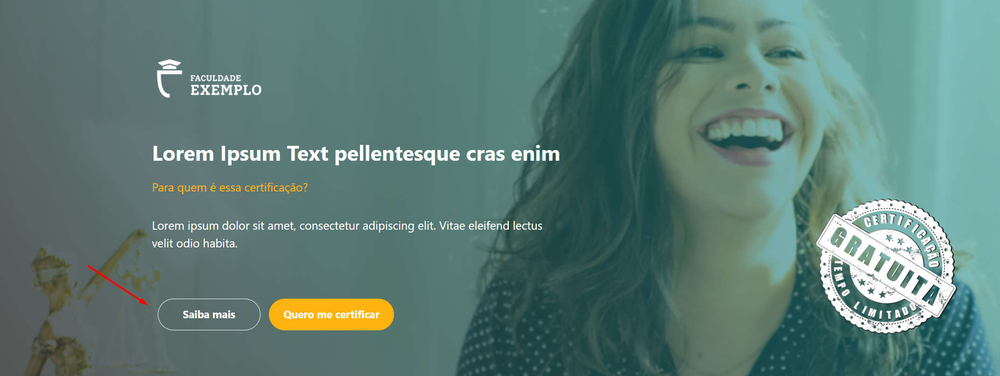

## Item 2 - Aplicação da regra 60-30-10 para contraste e hierarquia visual
* **Tipo:** Melhoria
* **Classificação:** Desejabilidade
* **Prioridade:** Baixa
* **Descrição:** A interface atual da página pode se beneficiar de um ajuste na paleta de cores para melhorar o foco do usuário. Sugere-se a aplicação da regra de design 60-30-10 (60% cor dominante no fundo, 30% cor secundária de apoio e 10% cor de destaque em elementos de conversão, como botões). Isso criará um equilíbrio visual melhor, facilitando a leitura e guiando o olhar de forma mais natural para os pontos de ação.

## Item 3 - Proporção do ícone da instituição e legibilidade do texto
* **Tipo:** Melhoria
* **Classificação:** Usabilidade
* **Prioridade:** Média
* **Descrição:** A hierarquia visual da página apresenta desequilíbrio. O ícone da instituição (logotipo) está muito pequeno, dificultando o reconhecimento da marca. Além disso, textos com cores vibrantes (como o laranja) aplicados sobre fundos complexos geram problemas de contraste e prejudicam a legibilidade. Sugere-se aumentar a proporção do ícone e ajustar as cores da tipografia para garantir uma leitura acessível e um layout harmonioso.
* **Anexo:** 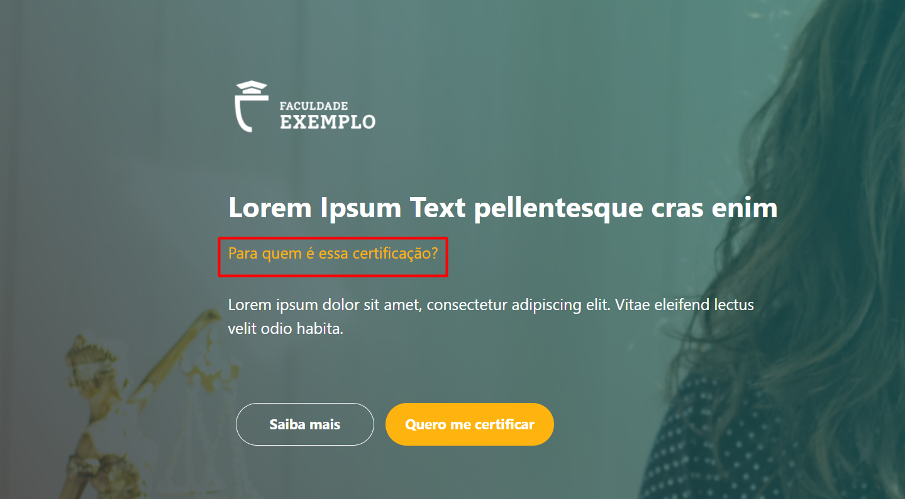

## Item 4 - Inconsistência visual do selo promocional
* **Tipo:** Melhoria
* **Classificação:** Desejabilidade
* **Prioridade:** Baixa
* **Descrição:** O selo "Certificação gratuita por tempo limitado" destoa do design limpo e moderno do restante da página. Por ter um estilo visual diferente, ele quebra a consistência da interface e polui visualmente a área da imagem. Sugere-se redesenhar ou reposicionar este selo para que atue como um gatilho de urgência de forma elegante e integrada ao design da página.
* **Anexo:** 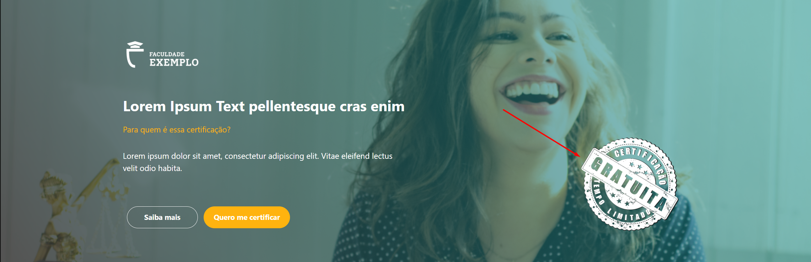

## Item 5 - Falta de validação e máscara no campo "Telefone"
* **Tipo:** Correção
* **Classificação:** Usabilidade
* **Prioridade:** Alta
* **Descrição:** O campo de formulário destinado ao telefone permite a inserção de caracteres alfabéticos e não possui uma máscara de formatação. Isso pode gerar inconsistência nos dados capturados no banco de dados e frustrar o usuário. O comportamento esperado é bloquear letras e aplicar uma máscara automática (ex: (XX) XXXXX-XXXX) conforme o usuário digita.
* **Anexo:** 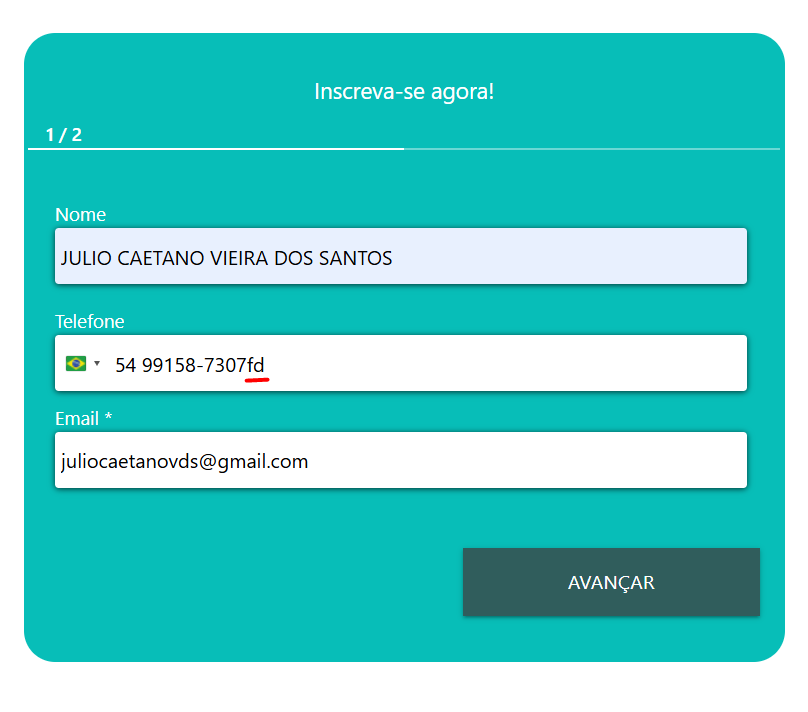

## Item 6 - Bloqueio no envio do formulário (Erro de "base local")
* **Tipo:** Correção
* **Classificação:** Utilidade
* **Prioridade:** Alta
* **Descrição:** Ao preencher todos os campos visíveis e clicar no botão "AVANÇAR", o sistema não prossegue para a etapa "2/2". Em vez disso, exibe um erro informando que "é necessário informar uma base local". Como não há nenhum campo na interface solicitando essa informação, o usuário fica impossibilitado de concluir a inscrição, caracterizando uma falha crítica no fluxo de conversão.
* **Anexo:** 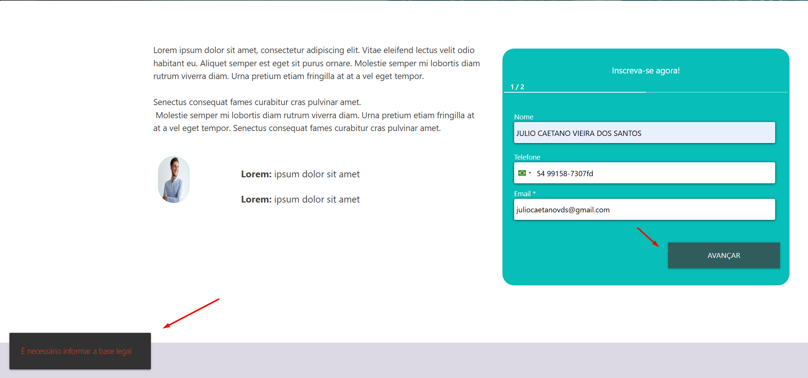

## Item 7 - Distorção de imagem e desalinhamento na seção de perfil
* **Tipo:** Correção
* **Classificação:** Desejabilidade
* **Prioridade:** Média
* **Descrição:** Na seção inferior da página, a foto de perfil do homem apresenta distorção de proporção (esmagada horizontalmente), o que passa uma percepção de falta de polimento. Além disso, os dois blocos de texto ao lado da imagem ("Lorem: ipsum...") parecem desconexos e desalinhados em relação ao avatar.
* **Anexo:** 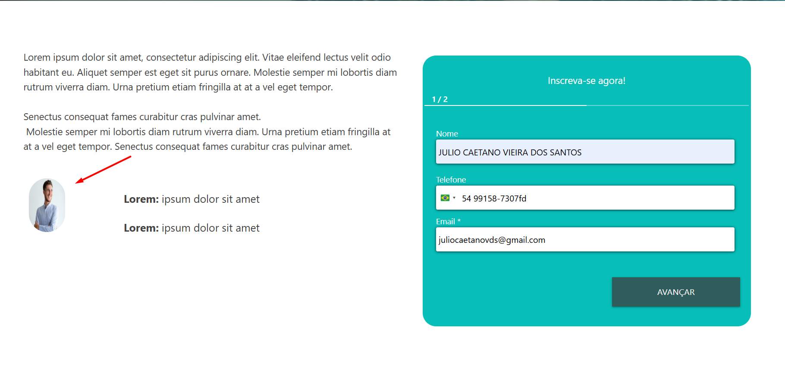

## Item 8 - Confusão visual no indicador de passos "1 / 2"
* **Tipo:** Melhoria
* **Classificação:** Usabilidade
* **Prioridade:** Baixa
* **Descrição:** O texto "1 / 2" com a linha sublinhada logo acima dos campos do formulário possui um design que remete a abas (tabs) clicáveis. Como o elemento não é interativo e serve apenas como um indicador de progresso, ele pode gerar confusão (falsos cliques).
* **Anexo:** 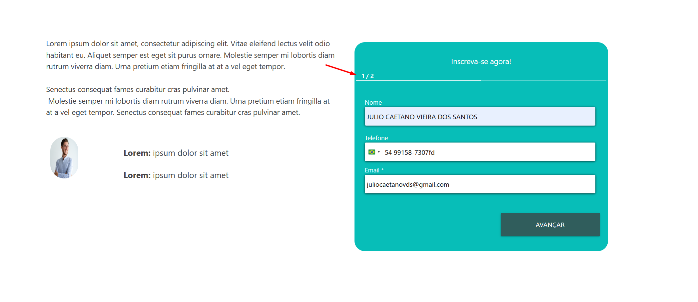

## Item 9 - Inconsistência na formatação e alinhamento de parágrafos
* **Tipo:** Correção
* **Classificação:** Desejabilidade
* **Prioridade:** Baixa
* **Descrição:** Na seção de texto com fundo cinza claro, há inconsistências na formatação tipográfica. Alguns parágrafos apresentam recuo na primeira linha, enquanto outros não. Além disso, o último bloco de texto está formatado inteiramente em negrito sem um propósito claro de hierarquia, destoando do restante do conteúdo. Sugere-se padronizar o espaçamento, recuo e peso da fonte em todos os blocos.
* **Anexo:** 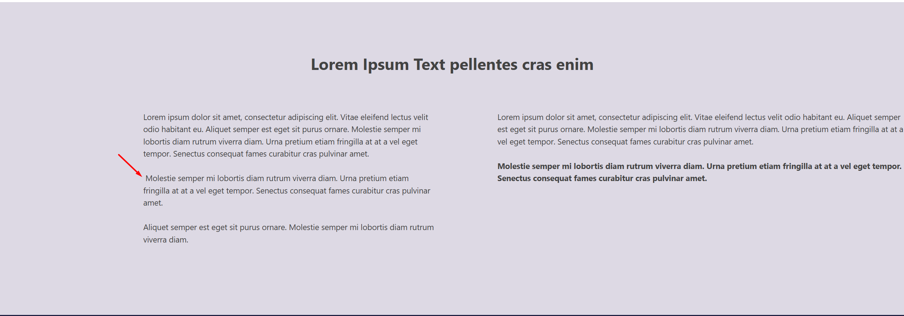

## Item 10 - Inconsistência de texto nos cards da seção "Outros Cursos"
* **Tipo:** Correção
* **Classificação:** Usabilidade
* **Prioridade:** Média
* **Descrição:** Os textos nos cards de "Outros Cursos" apresentam erros de digitação e falta de padronização. O primeiro card exibe "Saiba " (incompleto) e o terceiro exibe "Salba mais" (erro de digitação). O esperado é a padronização para "Saiba mais" em todos os cards.
* **Anexo:** 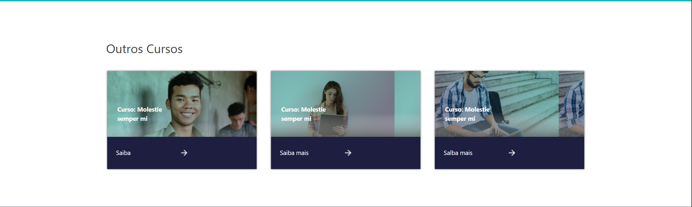

## Item 11 - Cards da seção "Outros Cursos" sem interatividade
* **Tipo:** Correção
* **Classificação:** Utilidade
* **Prioridade:** Alta
* **Descrição:** Nenhum dos três cards na seção "Outros Cursos" possui links ou áreas clicáveis ativas. Ao interagir com eles (ou clicar nas setas), nenhuma ação é executada, impossibilitando o usuário de acessar as informações adicionais dos cursos apresentados.
* **Anexo:** 

## Item 12 - Redirecionamento incorreto no ícone do YouTube
* **Tipo:** Correção
* **Classificação:** Utilidade
* **Prioridade:** Alta
* **Descrição:** No rodapé (footer) da página, o link associado ao ícone do YouTube está redirecionando incorretamente para a plataforma TikTok. O comportamento esperado é que o ícone direcione o usuário para o canal oficial da instituição no YouTube.
* **Anexo:** 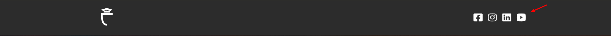

## Item 13 - Desalinhamento vertical na faixa inferior ("Lorem Ipsum Text pellente.")
* **Tipo:** Melhoria
* **Classificação:** Desejabilidade
* **Prioridade:** Baixa
* **Descrição:** Na faixa azul escura acima do rodapé final, o texto "Lorem Ipsum Text pellente." e o botão "Quero me certificar" não estão perfeitamente alinhados verticalmente (alinhamento central no eixo Y). Isso gera uma leve quebra na harmonia visual da seção. 
* **Anexo:** 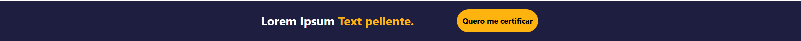