# Avaliação Exploratória - Página do Site

**URL Avaliada:** `https://qualidade.apprbs.com.br/site`

## Item 1 - Redundância de links e inconsistência no Top Bar
* **Tipo:** Melhoria
* **Classificação:** Usabilidade
* **Prioridade:** Baixa
* **Descrição:** Na barra utilitária superior (Top Bar), os links "Atendimento" e "WhatsApp" redirecionam para o mesmo destino, gerando redundância desnecessária. Além disso, há uma quebra de padrão visual, onde alguns itens possuem ícone e texto, enquanto as redes sociais possuem apenas ícones desalinhados.
* **Anexo:** 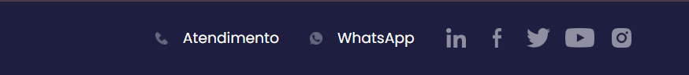

## Item 2 - Inconsistência de ícones no menu utilitário
* **Tipo:** Melhoria
* **Classificação:** Desejabilidade
* **Prioridade:** Baixa
* **Descrição:** Ainda na barra superior (canto direito), o link "BIBLIOTECA" é acompanhado por um ícone de livro, enquanto o link vizinho "INSTITUCIONAL" apresenta apenas texto. A falta de padronização quebra a consistência visual da interface.
* **Anexo:** 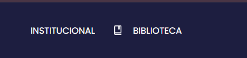

## Item 3 - Botões inativos no Carrossel Principal (Hero Banner)
* **Tipo:** Correção
* **Classificação:** Utilidade
* **Prioridade:** Alta
* **Descrição:** Os botões presentes nas imagens do carrossel inicial (como "INSCREVA-SE" e "SAIBA MAIS") não possuem links configurados. Ao serem clicados, nenhuma ação ou redirecionamento ocorre. Sendo esta a principal área de destaque da página, a inatividade desses botões representa uma falha crítica no fluxo do usuário.
* **Anexo:** 

## Item 4 - Quebra de layout e desalinhamento no card "Pesquisas reconhecidas"
* **Tipo:** Correção
* **Classificação:** Desejabilidade
* **Prioridade:** Média
* **Descrição:** Na seção "Conheça nossos diferenciais", o terceiro card ("Pesquisas reconhecidas internacionalmente") apresenta uma quebra clara de layout. O espaçamento (margin/padding) entre o título, quebrando a simetria do grid.
* **Anexo:** 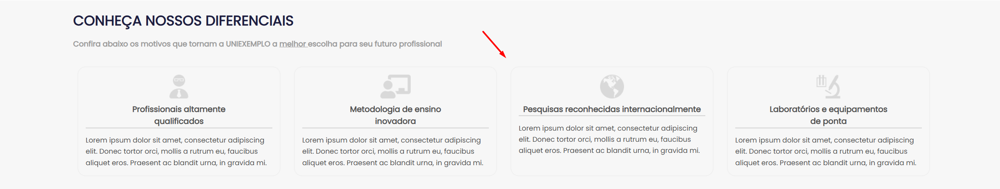

## Item 5 - Baixo contraste e estilo visual dos cards
* **Tipo:** Melhoria
* **Classificação:** Desejabilidade
* **Prioridade:** Baixa
* **Descrição:** O estilo atual dos cards da seção de diferenciais (fundo branco com um sombreamento excessivamente claro) não oferece contraste suficiente contra o fundo da página.
* **Anexo:** 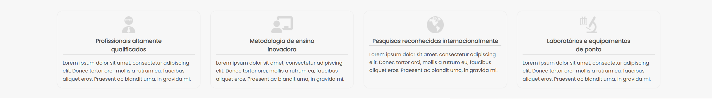

## Item 6 - Quebra abrupta de fundo na imagem da seção de eventos
* **Tipo:** Correção
* **Classificação:** Desejabilidade
* **Prioridade:** Média
* **Descrição:** A imagem localizada na lateral direita da seção "Próximos Eventos" possui um fundo sólido cinza claro que sobrepõe de forma abrupta o fundo escuro e texturizado da página, criando uma quebra de layout.
* **Anexo:** 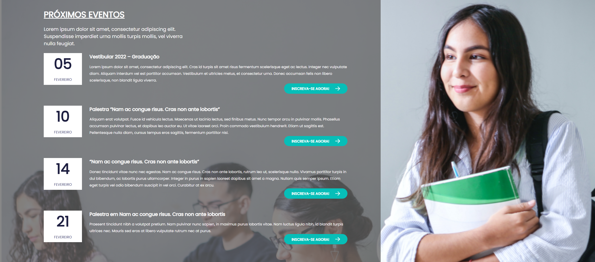

## Item 7 - Evento desatualizado listado como "Próximo Evento"
* **Tipo:** Correção
* **Classificação:** Utilidade
* **Prioridade:** Alta
* **Descrição:** O primeiro card da seção destinada a "Próximos Eventos" destaca o "Vestibular 2022". A exibição de um evento passado (datado de quatro anos atrás) em uma área de eventos futuros gera confusão para o usuário e indica que o conteúdo do site não está sendo atualizado adequadamente.
* **Anexo:** 

## Item 8 - Inconsistência de formatação nos títulos dos eventos
* **Tipo:** Correção
* **Classificação:** Desejabilidade
* **Prioridade:** Baixa
* **Descrição:** Há falta de padronização na formatação textual dos títulos dos eventos secundários. O segundo e o terceiro itens da lista utilizam aspas no título (ex: "Nam ac congue..."), enquanto o quarto item não utiliza aspas, apesar de seguir a mesma estrutura de conteúdo.
* **Anexo:** 

## Item 9 - Falta de validação e máscara no campo "Telefone" da Newsletter
* **Tipo:** Correção
* **Classificação:** Usabilidade
* **Prioridade:** Alta
* **Descrição:** O campo "Telefone" no formulário de inscrição da Newsletter permite a inserção de letras e caracteres não numéricos. Além disso, não possui uma máscara de formatação visual para guiar o preenchimento. O comportamento esperado é aceitar apenas números e aplicar a máscara correspondente.
* **Anexo:** 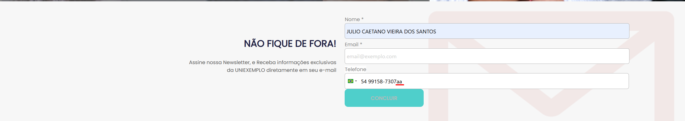

## Item 10 - Bloqueio no envio do formulário de Newsletter
* **Tipo:** Correção
* **Classificação:** Utilidade
* **Prioridade:** Alta
* **Descrição:** Ao preencher os campos e clicar no botão "CONCLUIR", o formulário apresenta um erro que impede a finalização do cadastro, replicando o mesmo comportamento de bloqueio encontrado na página de certificação. O esperado é que os dados sejam processados e uma mensagem de sucesso seja exibida.
* **Anexo:** 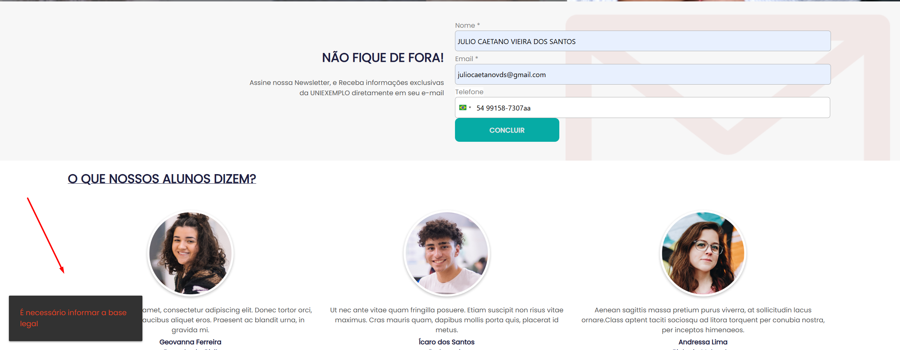

## Item 11 - Problemas de espaçamento e alinhamento na seção da Newsletter
* **Tipo:** Correção
* **Classificação:** Desejabilidade
* **Prioridade:** Baixa
* **Descrição:** A estrutura visual da seção de captura de e-mails apresenta desalinhamento. O bloco de texto promocional ("NÃO FIQUE DE FORA!") encontra-se excessivamente colado aos campos do formulário, indicando ausência de margens e de um grid bem definido entre os elementos.
* **Anexo:** 

## Item 12 - Sobrescrita visual no título da seção de Depoimentos
* **Tipo:** Melhoria
* **Classificação:** Desejabilidade
* **Prioridade:** Baixa
* **Descrição:** O título "O QUE NOSSOS ALUNOS DIZEM?" apresenta uma formatação onde a linha de sublinhado (underline) está sobreposta à base das letras, cortando caracteres como a letra "Q". Isso prejudica a estética e a legibilidade da tipografia.
* **Anexo:** 

## Item 13 - Erro de formatação no texto do terceiro depoimento
* **Tipo:** Correção
* **Classificação:** Desejabilidade
* **Prioridade:** Baixa
* **Descrição:** No card referente à aluna "Andressa Lima", há um erro de digitação no texto do depoimento. Há a ausência de espaço após o ponto final, resultando no trecho "ornare.Class". O esperado é a aplicação do espaçamento correto ("ornare. Class").
* **Anexo:** 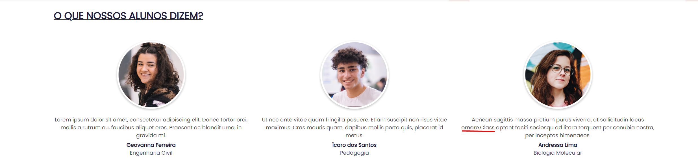

## Item 14 - Desalinhamento da navegação inferior
* **Tipo:** Correção
* **Classificação:** Desejabilidade
* **Prioridade:** Baixa
* **Descrição:** No sub-rodapé da página, o link "Institucional" apresenta um recuo à direita, não estando alinhado verticalmente com a margem esquerda da seção "Endereço" logo acima.
* **Anexo:** 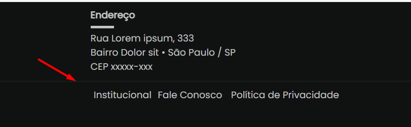

## Item 15 - Inconsistência visual nos links de redes sociais
* **Tipo:** Melhoria
* **Classificação:** Desejabilidade
* **Prioridade:** Baixa
* **Descrição:** A seção "UNIEXEMPLO Social" utiliza logotipos textuais completos das redes sociais, contrastando negativamente com o padrão de ícones minimalistas utilizado no cabeçalho (Top Bar). Fugindo do padrão da tipográfia
* **Anexo:** 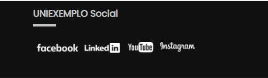

## Item 16 - Erro de formatação no contato de e-mail
* **Tipo:** Correção
* **Classificação:** Desejabilidade
* **Prioridade:** Baixa
* **Descrição:** Na coluna "Contatos", a linha referente ao e-mail exibe um caractere "@" solto seguido de um espaço antes do endereço real ("@ exemplo@uniex.com.br"). O esperado é a exibição limpa apenas do endereço de e-mail.
* **Anexo:** 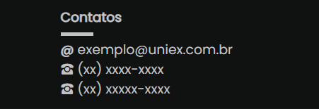

## Item 17 - Ausência de separação visual nos links do sub-rodapé
* **Tipo:** Correção
* **Classificação:** Usabilidade
* **Prioridade:** Baixa
* **Descrição:** Os links inferiores ("Institucional Fale Conosco Política de Privacidade") não possuem espaçamento adequado ou caracteres de separação entre si. Isso dificulta a leitura e a identificação de onde termina um link e começa o outro. O esperado é uma separação visual clara entre os itens clicáveis.
* **Anexo:** 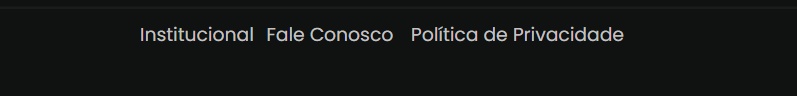